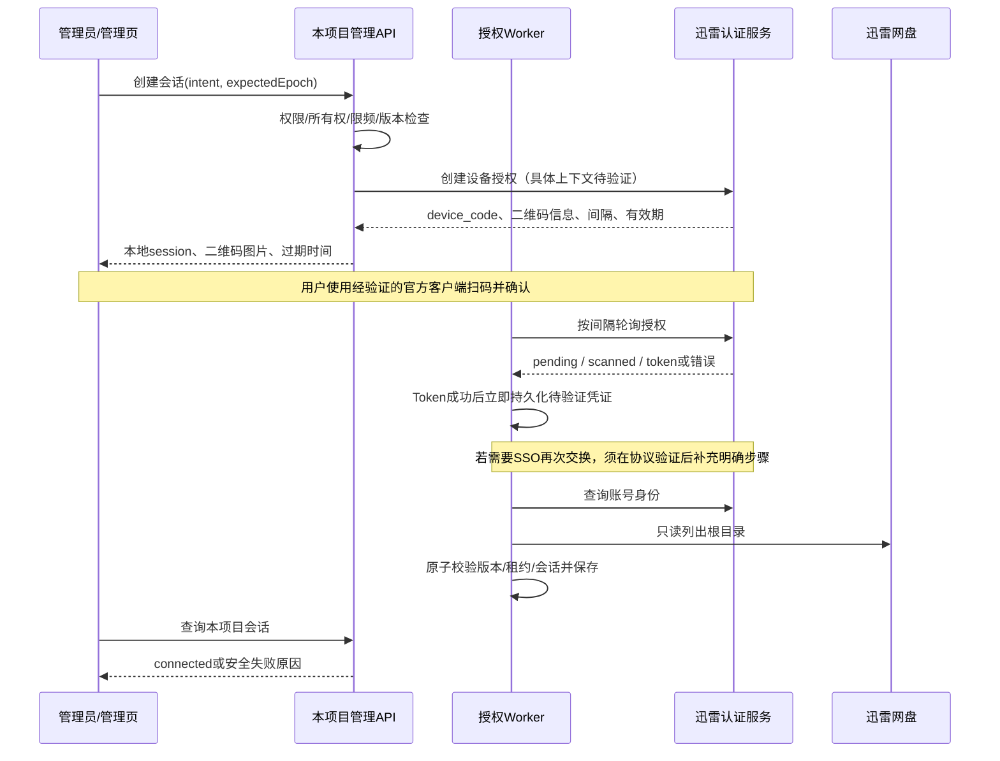

# 迅雷扫码登录：需求与实现设计

> 状态：以下为原始调研与需求设计；后续已实现默认关闭的实验适配，详情见 [当前实现说明](xunlei-qr-login-implementation.md)。真实协议与账号验收仍未完成，不代表可直接上线。
>
> 调研日期：2026-10-08（Asia/Shanghai）
> 代码基线：`6dcfbca78fc702e85c5ca5c499cb1a1192a5f0ac`
> 范围：后台迅雷账号连接、重新授权、更换账号及授权凭证维护。

## 1. 结论与决策

1. **当前不能扫码是项目未实现，不是迅雷不存在扫码功能。** `src/cloud_auth/providers.rs` 的 `qr_supported()` 排除 Xunlei，`start()`、`poll()` 的迅雷分支返回 `Unsupported`。引入授权模块的 `bc79212` 已如此，基线优化提交没有修改这些授权分支。
2. 官方公开登录脚本存在 Device Code 扫码链路：创建设备码、展示二维码、轮询令牌、已扫码待确认、过期和拒绝处理。依据为静态脚本观察，不是实际登录成功记录。
3. **不能仅开启 `qrSupported`。** 尚需验证实际客户端身份、二维码兼容性、SSO 令牌是否需要再次换取网盘令牌，以及设备身份和 `x-captcha-token` 的获取、维护方式。
4. 采用“协议验证 → 独立适配器 → 复用现有会话/账号框架 → 真实只读验收 → 开启能力”的实施顺序。任一关键前置条件不成立，保持高级导入，不对外宣称支持扫码。
5. 本轮只提交需求设计产物到工作区；没有开发业务代码、创建真实登录会话、扫码、调用账号写操作，也不执行 Git 提交或推送。

## 2. 调研方法与证据等级

- 阅读本项目授权后端、网盘驱动、管理 API、前端和迁移结构。
- 通过公开 GET 读取迅雷官网、登录页及其静态 JavaScript；未执行下载的脚本。
- 阅读固定版本 OpenList 驱动作为行为对照，不把它当作官方接口承诺。
- 参考 RFC 8628 的设备授权安全及轮询规则，不假定迅雷实现完全符合该 RFC。
- 本次没有找到可据以承诺稳定性的官方开放 API 文档；“官网正在使用”不等于“允许任意第三方客户端使用”。

| 等级 | 证据 | 能支持的结论 | 不能支持的结论 |
| --- | --- | --- | --- |
| A：本地代码 | 基线代码、Git 历史 | 当前能力、字段、流程和缺口 | 上游接口今天一定可用 |
| A：官方静态资源 | 官方登录脚本、网盘 SSO/captcha 脚本 | 页面使用过的端点、分支、参数结构 | 参数完整、任意客户端可用、已实测成功 |
| B：开源实现 | OpenList 固定 commit 的 thunder 系列驱动 | Token、设备、captcha 是独立关注点 | 本项目扫码方案已经可行 |
| C：设计/待验证 | 本文方案、错误映射、数据结构 | 后续实施和验收目标 | 已实现功能或真实响应样本 |

公开资源可能被替换或下线，来源和摘要见第 14 节。调研缓存位于被忽略的 `.tmp/xunlei-qr-research/`，不是运行时依赖，也不应提交原站整包脚本。

## 3. 用户需求

### 3.1 功能需求

| 编号 | 需求 | 验收要点 |
| --- | --- | --- |
| FR-01 | 管理员为迅雷创建扫码会话 | 能力开关开启后显示扫码入口；开关关闭仍可高级导入 |
| FR-02 | 展示二维码、有效期和操作说明 | 二维码由后端按经验证的官方格式本地生成；不虚构固定有效期 |
| FR-03 | 区分待扫码、已扫码待确认、验证中、成功 | 不把扫码事件或仅取得 Token 当作连接成功 |
| FR-04 | 支持取消、拒绝、过期和手动重试 | 终态停止轮询；重试创建新会话，不自动无限刷新二维码 |
| FR-05 | 支持已有账号重新授权 | 必须为同一稳定账号标识；不接受静默换号 |
| FR-06 | 支持显式更换账号 | 使用 replace 意图与 expectedEpoch；不得把旧账号清理任务交给新账号 |
| FR-07 | 验证并保存完整可用凭证 | 身份查询和根目录只读访问成功后才显示已连接 |
| FR-08 | 维护可续期凭证 | Token 刷新与 captcha 生命周期分别设计，不宣称永久免重新登录 |
| FR-09 | 可解释地处理风控和上游失败 | 显示安全错误原因与下一步；不暴露上游原始 body 或敏感字段 |

### 3.2 非功能需求

- 复用管理员权限、来源检查、会话所有权、禁止缓存和账号版本检查。
- Token、device_code、设备签名只能留在后端；前端只取得允许的会话展示字段。
- 网络故障、重复 Worker、重启、取消和换号并发不得写坏当前账号。
- 迅雷特有轮询策略隔离，不改变百度、夸克、阿里、光鸭既有协议语义。
- 可用阶段、稳定错误码、HTTP 状态、耗时定位故障，但日志不得包含凭证、二维码完整 URL、用户资料或原始响应。

### 3.3 非目标

不增加密码登录；不抓取用户浏览器 Cookie；不嵌入官方登录 SDK 作为绕过后端框架的捷径；不破解签名或绕过验证码/风控；不实现文件转存、删除等功能来证明扫码成功；不承诺所有迅雷客户端版本都兼容。

## 4. 现有实现与差距

| 模块 | 已有能力 | 本需求的缺口 |
| --- | --- | --- |
| `src/cloud_auth/providers.rs` | Context、LoginStart、Poll、二维码生成、迅雷刷新和身份查询 | 迅雷 start/poll 未实现；能力固定关闭 |
| `src/cloud_auth/mod.rs` | 会话、管理员绑定、限频、Worker 租约、验证及提交 | 首次立即 poll、统一降速/重试策略不完全适配迅雷 |
| `src/handlers/cloud_accounts.rs` | 管理员 API、origin 检查、禁止缓存 | 原则上不增加端点，补充安全错误和能力控制 |
| `src/cloud_drive/extended/credentials.rs` | 迅雷 Token、user_id、captcha 与设备头解析 | 默认 client_id 与官网观察值不同；缺少扫码凭证的完整来源 |
| `src/cloud_drive/extended.rs` | 迅雷网盘业务访问 | 需验证扫码所得凭证确实可访问根目录 |
| `frontend/components/admin/CloudProviderCard.vue` | 按 qrSupported 显示入口 | 功能验证前不得开启 |
| `frontend/pages/admin/cloud-accounts.vue` | 通用二维码对话框和本地 API 轮询 | 迅雷说明、风险提示、错误交互验证 |
| `frontend/lib/cloudAccounts.ts` | 会话类型、状态标签、二维码安全限制 | 增加经验证的迅雷文案及错误映射 |

当前 `start_login()` 对同 provider 的新会话取消旧活跃会话；按 actor+provider 限制每分钟最多 6 次创建；创建请求整体超时约 35 秒。Worker 使用 90 秒租约。上述值是代码现状，不是迅雷协议约定。

当前已有关键保护应保留：收到 `Poll::Ready(raw)` 后先保存 `pending_credential` 并进入 verifying，再验证账号和根目录，最后按账号版本、凭证版本及租约条件提交。重启后验证阶段重用暂存凭证，不再兑换 device_code。

## 5. 官方候选协议与待确认边界

### 5.1 静态脚本观察

以下描述来自官方脚本，不是实测请求/响应合同。生产认证 origin 在官网配置中观察为 `https://xluser-ssl.xunlei.com`；登录 iframe 内部使用的实际 client 配置仍需联调确认。

| 阶段 | 方法/路径或动作 | 静态观察 | 必须联调确认 |
| --- | --- | --- | --- |
| 创建设备授权 | POST `/v1/auth/device/code` | `genDeviceCode()` 注入 client_id；UI 调用 `startDeviceAuthorization({scope:""})`；可带 `meta.ui_client_key` | client 来源、必需 headers、编码方式、设备/captcha 前置条件、有效期 |
| 读取结果 | Device Code response | 使用 device_code、interval、verification_uri_complete；SDK 支持 short_uri_complete | 字段完整性、返回类型、缺省规则、错误格式 |
| 二维码包装 | 官方 UI 本地拼接 | 取 verification_uri_complete 的 query，接到 `https://i.xunlei.com/device/`；再编码成 qrlogin 的 redirect_uri | 是否适用于目标手机端、是否必须包装、版本差异 |
| 轮询授权 | POST `/v1/auth/token` | grant_type 为 `urn:ietf:params:oauth:grant-type:device_code`，携带 device_code、client_id；有配置才带 client_secret | 客户端权限、Token audience/scope、是否需额外交换 |
| 查询身份 | GET `/v1/user/me` | 本项目迅雷 identity 已请求认证 origin 的此路径 | 新授权令牌是否可用、稳定 subject 字段 |
| 网盘验证 | 本项目 `drive.list(p.root())` | 业务 host 为 `https://x-api-pan.xunlei.com/` | captcha、设备上下文和业务权限是否完整 |

官方 UI 观察到的二维码外层地址为：

```text
https://xluser-ssl.xunlei.com/xluser.core.login/v3/qrlogin?redirect_uri=<URL-encoded device URL>
```

不得把 `short_uri_complete` 直接认定为正确手机扫码内容。处理 URL 必须用 URL 解析器，核对 HTTPS、精确官方域名、路径、参数大小和内层 redirect_uri；禁用非白名单重定向，不允许任意 URL 经后端请求。二维码含授权能力，应与 device_code 一样限制暴露。

### 5.2 错误和状态观察

| 上游观察 | 目标本地行为 |
| --- | --- |
| authorization_pending / WAITING_CONNECT | waiting，按间隔继续 |
| authorization_pending / details[0].state = WAITING_CONSENT | scanned，提示手机确认，仍未连接 |
| slow_down | 保留当前 waiting/scanned 展示，延迟下一次请求 |
| expired_token | expired，停止请求，允许手动重新生成 |
| access_denied | denied，停止请求，不覆盖旧账号 |
| Token 返回成功 | 暂存凭证并进入 verifying；不是直接 connected |
| 无法解释的响应 | failed + 安全协议错误，不猜测成功 |

### 5.3 三个上线前阻塞问题

**G1：客户端和 SSO 链路。** 官网初始化资源观察到 clientId 为 `Xqp0kJBXWhwaTpB6`，本项目迅雷驱动默认是 `ZUBzD9J_XPXfn7f7`。两者都是公开客户端标识，但不能混用。扫码页面拿到的可能是 SSO/UI 会话凭证；SDK 另有 state、PKCE、授权回调逻辑。必须查清是否还需 authorize/code exchange，以及真实 client_id、audience、scope 和客户端使用条件。不能把官网 clientId 直接硬编码作为最终方案。

**G2：设备和 captcha。** 当前驱动要求有效 Token、user_id 和 captcha_token，还支持设备 ID、签名等头。能查身份不等于能访问网盘。需要明确合法获取和续期 captcha 的途径，以及它与 client、device、action 的绑定关系；若必须人工挑战，应清晰引导官方验证或高级导入，不静默绕过。

**G3：可维护性。** 必须分别验证 Token 续期、Refresh Token 轮换、captcha 过期和设备上下文稳定性。只完成一次扫码不能证明长期可用。无合法、可维护的凭证来源则 No-Go。

## 6. 目标架构与流程

建议新增 `src/cloud_auth/providers/xunlei.rs` 独立适配器，由原 providers 模块分发。复用 Http 的安全限制，但需要迅雷专用的结构化响应，保留 status、Retry-After、OAuth error 和受限 details；不要把完整上游响应暴露给业务日志或前端。



复用以 `/api` 为前缀的现有接口：

- POST `/admin/cloud-accounts/xunlei/login-sessions`
- GET/DELETE `/admin/cloud-accounts/xunlei/login-sessions/{id}`
- POST `/admin/cloud-accounts/xunlei/import`
- POST `/admin/cloud-accounts/xunlei/check`
- DELETE `/admin/cloud-accounts/xunlei/connection`

前端只轮询本项目，不直接向迅雷请求 Token。现有浏览器轮询间隔约为 `max(2, intervalSeconds || 3)` 秒，不应将其误当作 Worker 的上游请求节奏。会话 API 仅返回已有安全展示字段及经过审查的错误码。

## 7. 状态、轮询和并发设计

### 7.1 状态机

主路径：`starting → waiting → scanned → verifying → connected`。未观察到 scanned 但直接返回令牌时允许 `waiting → verifying`。任一非终态可因明确原因进入 cancelled、expired、denied 或 failed。

- scanned 不因 pending 或 slow_down 在 UI 上倒退为 waiting；验证中不继续扫码轮询。
- 使用上游有效期计算 expires_at，并以数据库时钟控制本地调度；未知有效期不得虚构为“官方 5 分钟”。缺少必要字段按协议错误处理，缺省规则仅在验证后确定。
- 终态取消调度，清除临时 context、pending credential 和二维码材料，保留无秘密审计摘要；清理时间和失败重试应纳入实现及测试。
- “兑换结果未知”建议使用内部 error/stage（例如 proposed `exchange_outcome_unknown`），映射为 failed 并提示重新授权，不冒充已连接。不是本轮新增 API 状态。

### 7.2 调度修正

当前问题：首次 `next_poll_at=now()`；Slower 使用 `LEAST(interval_seconds+5,30)`；网络/限流错误常固定 10 秒重试。它们可能违反较长的服务端等待要求，也可能丢失 scanned 展示。

拟采用 provider-scoped 的结构化结果/下一次最小延迟：

1. 首次请求不得早于创建响应 interval。
2. 普通 pending 按当前会话 interval 等待；间隔必须校验类型、正值和合理边界。
3. RFC 8628 对 slow_down 要求后续轮询间隔增加至少 5 秒；官方脚本观察为下一间隔取初始 interval 的两倍，不能宣称两者完全一致。候选保守策略取 `max(当前间隔+5秒, 初始间隔×2, 有效Retry-After)`，并以联调结果最终确认。
4. 429 保留并解析 Retry-After（秒或 HTTP 日期），不得统一缩短到 10/30 秒；无有效值时使用不低于当前间隔的指数退避与非负抖动。
5. 网络超时退避，区分普通 pending 请求与可能已完成兑换的请求；不将含糊结果盲目重试为成功。
6. 如果下次允许请求时间超过本地会话有效期，则不再请求，进入过期终态。
7. 参数缺省、退避上限和总时长均需明确配置；限制本地等待不意味着允许提前请求上游。

当前公共 Http 在收到 429 后直接返回 RateLimited，未向适配器提供 body/Retry-After；迅雷适配层必须弥补这一信息缺口。带 JSON 对象的 4xx 可能被交给调用者，应识别业务错误，不一概当作凭证失效。

### 7.3 并发与故障恢复

- 持续保留会话所有权、同 provider 会话互斥、lease fencing、binding_epoch 和 token_revision 校验。
- 每次兑换/验证/提交前后检查取消、过期、替换和租约失效；迟到结果不得覆盖新会话或新账号。
- 成功取得原始凭证后尽快持久化，之后验证可以重试，但不可再次兑换同一个 device_code。
- 上游成功但响应丢失，或进程在本地落盘前崩溃，无法靠本地事务保证 exactly-once。拟记录兑换阶段和尝试标识；若不能可靠确认是否已消费，失败并要求重扫，不猜测结果。
- 领取任务和保存结果都需租约条件。有效请求时长应受租约约束；续租失败时停止后续写入。仅有 lease 并不保证上游绝不发生重复请求。
- 新授权失败不修改已有有效账号；显式断开或替换按原有业务语义处理。

## 8. 数据与凭证契约

优先复用 `cloud_login_sessions.context_json`，增加带版本的迅雷内部结构。以下是字段设计，不是上游真实响应：

| 内部字段 | 用途与约束 |
| --- | --- |
| schema_version / provider | 识别适配器数据版本，未知版本安全失败 |
| client_id / auth_flow | 记录实际授权客户端与链路，不借用驱动默认值 |
| device_id / device_context | 经验证的设备上下文；限制字段、大小和生命周期 |
| device_code | 仅后端短期保留，不进入 API、日志、指标或 URL查询日志 |
| initial_interval / current_interval / next_poll_at | 可恢复调度；与数据库调度列职责明确，避免双源漂移 |
| expires_at / phase / exchange_attempt_id | 过期、恢复和未知兑换结果处理 |
| pending_credential | 复用现有验证阶段存储，不复制到前端结构 |

最终 credential 至少需要经验证的 access_token、user_id、实际 client_id、必要的 device/captcha 信息；refresh_token、token_type、expires_at 和可选 client_secret 仅在真实流程提供且确有需要时保存。不得从别的客户端抄取 secret，缺失必需字段时拒绝提交。

- `cloud_login_sessions` 已接受 xunlei；通常不需新表。若必须新增列，应新增迁移，而非修改 044 等已发布迁移；以实施时最新编号为准。
- 凭证目前明文存储在 PostgreSQL，不宣称已加密。数据库与备份访问控制是部署前置条件；加密改造需另立需求。
- 不用任意 JSON 覆盖完整旧凭证；定义每个字段的合并/清除语义。敏感字段不得在异常 Debug 输出中出现。
- 现有导入凭证保持兼容。禁止因更改扫码默认 client 而静默重写历史导入账号。

## 9. 凭证维护与可用性

现有迅雷刷新分支使用认证 origin 的 `/v1/auth/token` 和 refresh_token grant；需存在明确 client_id，并仅在原凭证提供时带 client_secret。现有合并逻辑保留设备字段，应补充以下验证：

- 新 Refresh Token 返回时原子替换；未返回时是否保留原值须以协议语义验证，不武断认定失效。
- 更新 access_token 不得丢失同源 client/device 信息，不得覆盖并发扫码获得的更新凭证。
- captcha 过期不等同于 Refresh Token 过期；单独识别并走经过验证的维护流程。
- 能刷新但不能访问根目录时不得持续显示正常；应给出重新授权/官方验证/高级导入的明确路径。
- 无 refresh_token 的成功授权必须明确标识维护限制，不承诺后台自动续期。
- 所有维护失败对其他 provider 和资源清理任务隔离；不对未知账号执行文件写操作。

## 10. 前端与安全错误

保留现有共用对话框。文案候选：“使用迅雷官方客户端扫码，并在手机端确认登录”；具体客户端、扫一扫入口及平台兼容性需实测后才能定稿。

展示规则：有效期由服务端返回；scanned 显示等待手机确认；verifying 显示正在检查账号与网盘权限；connected 展示安全账号信息；过期/拒绝/失败只允许用户主动重试。

建议新增或复用安全原因类别（名字待实现时对齐既有枚举）：客户端配置缺失、协议不兼容、需要官方验证、网盘权限不足、账号不匹配、授权已过期、限流、网络暂不可用、兑换结果未知。错误只携带固定原因和排查标识，不透传令牌端点 body。

安全要求：

- 仅创建者管理员可查询/取消会话，不能仅凭 UUID 放行；API 保持 no-store/private。
- 限频同时覆盖创建和后台上游请求；不得通过刷新页面制造多个授权循环。
- 二维码只作为受限 base64 图片返回，沿用 safeQrImage 约束；二维码不是可以公开缓存的普通图片。
- 禁止凭证、device_code、Cookie、captcha、签名、完整二维码地址进入日志、截图测试快照和埋点。
- 不在前端新增官方脚本/CDN依赖；后端限制域名、重定向、响应大小和超时。

## 11. 未来文件改动清单

本节为实施计划，**本轮不修改以下业务文件**。

| 文件/范围 | 拟修改 |
| --- | --- |
| `src/cloud_auth/providers/xunlei.rs`（新增） | typed 协议、start/poll、错误分类、上下文校验 |
| `src/cloud_auth/providers.rs` | 分发、能力控制、兼容的响应/调度扩展、刷新边界 |
| `src/cloud_auth/mod.rs` | 首次延迟、provider-scoped退避、未知兑换结果及持久化保护 |
| `src/cloud_drive/extended/credentials.rs` | 扫码凭证必需字段、client/device一致性，保持导入兼容 |
| `src/cloud_drive/extended.rs` | 仅在联调证明必要时补齐合法请求上下文 |
| `src/handlers/cloud_accounts.rs` | 必要的安全原因映射；保持现有权限/API契约 |
| `frontend/lib/cloudAccounts.ts` | 迅雷说明、安全错误文案、类型扩展（若必要） |
| `frontend/pages/admin/cloud-accounts.vue` | 状态/终态/重试交互与展示 |
| `frontend/components/admin/CloudProviderCard.vue` | 能力开启后入口验证，保留高级导入 |
| 后端/前端测试、配置说明 | mock协议、并发/维护/权限回归、默认关闭的上线开关 |
| `migrations/`（仅必要时） | 新增兼容迁移，不修改已发布迁移 |

## 12. 实施阶段与交付门槛

| 阶段 | 交付物 | 进入下一阶段的条件 |
| --- | --- | --- |
| P0：本轮调研 | 本文、来源、风险与验收清单 | 用户审阅需求；不开发 |
| P1：协议可行性验证 | 脱敏请求契约、实际client/SSO链路、二维码兼容性和captcha说明 | 经用户明确授权后用账号做只读验证；G1/G2均通过 |
| P2：后端与mock | 独立适配器、调度/持久化/恢复和安全测试 | mock矩阵通过；能力仍默认关闭 |
| P3：管理页与维护 | 状态文案、刷新/captcha策略、导入兼容 | UI、安全、维护与其他网盘回归通过 |
| P4：受控真实验收 | 授权→身份→根目录→续期验证记录 | G3通过，保留脱敏证据和版本信息 |
| P5：灰度启用 | 配置说明、监控、回滚方案 | 管理员明确开启，不在未经验证部署中自动打开 |

能力开关拟默认关闭，具体配置名实施时确定。关闭后禁止新扫码会话、取消仍活跃的迅雷扫码任务；已连接账号不自动删除，凭证维护和高级导入继续按既有策略运行。回滚不修改绑定版本来伪造旧状态，不删除账号数据。

可观测性仅记录 provider、stage、安全 reason、HTTP status、耗时和聚合计数。指标避免会话/用户高基数标签。验证创建失败率、轮询退避、授权过期、根目录校验失败和维护失败即可，不采集原始响应。

## 13. 测试矩阵与最终验收

| 类别 | 必测情形 | 预期 |
| --- | --- | --- |
| 协议解析 | 正常结果、缺device_code、错误类型/间隔、超大body、非JSON、未知error | 安全拒绝，不panic、不假成功 |
| 二维码 | 官方格式、嵌套redirect、恶意host/协议、错误编码、短链 | 仅生成验证通过的官方内容，无任意URL请求 |
| 状态 | pending、WAITING_CONSENT、直接Token、拒绝、过期 | 映射正确，scanned不回退，终态停止 |
| 调度 | 首次间隔、连续slow_down、429、Retry-After>30秒、网络故障 | 从不早于允许时间请求，不能超时后继续轮询 |
| 兑换恢复 | Token落盘后重启、成功响应丢失、落盘前崩溃 | 验证重用暂存凭证；未知结果不冒充成功 |
| 并发 | 两Worker、lease过期、取消后迟到、换号后旧响应 | 旧任务不能提交或覆盖新凭证 |
| 账号意图 | 首次连接、同账号reauthorize、异账号reauthorize、replace、epoch冲突 | 同账号规则和显式替换生效 |
| 可用性 | 身份成功但根目录失败、缺captcha、错误client/device | 不显示connected、不覆盖旧有效账号 |
| 维护 | Token轮换、无新refresh、captcha过期、刷新与扫码竞争 | 按已验证语义合并，维护失败可解释 |
| 安全 | 非管理员、跨管理员读/取消、跨站写、日志与API泄露 | 拒绝越权，凭证不泄漏 |
| 前端 | 倒计时、关窗取消、过期重试、开关关闭、网络错误 | 不自动创建新session，不无限轮询 |
| 回归 | 其余四家扫码/导入/续期、历史迅雷导入、清理归属 | 行为不退化，数据不串账号 |

最终验收条件（全部满足才能称“迅雷扫码已支持”）：

- AC-01：目标部署可创建并展示官方客户端可识别的二维码；记录手机平台和版本，不扩大兼容性结论。
- AC-02：扫码确认后取得匹配 client/device 的完整凭证，身份及根目录只读校验通过，才进入 connected。
- AC-03：拒绝、过期、取消、限流、风控均有正确终态/退避和用户提示。
- AC-04：重新授权和换账号的版本、账号身份及旧任务隔离全部通过。
- AC-05：凭证与二维码材料不泄漏；重启、并发和迟到响应测试通过。
- AC-06：刷新和 captcha 维护有可复现验证记录；不能维护的情形有明确重新授权路径。
- AC-07：高级导入与其他网盘回归通过；开关关闭/回滚行为可验证。

真实验收必须另获账号所有者明确授权；本轮未执行。成功标准只需只读访问，不要求上传、删除、转存或公开分享任何文件。

## 14. 来源与复查记录

外部地址以下以代码形式保留，便于复查；哈希针对本轮下载文件，不能保证远端以后不变化。函数名适合定位压缩脚本，行号不稳定。

### S1：迅雷官方入口与登录脚本

```text
https://pan.xunlei.com/
https://i.xunlei.com/xluser/auth/
https://i.xunlei.com/xluser/dist/auth.js?v=202609210216
```

登录页标题为“使用迅雷账号登录”。auth.js：888798 bytes；SHA-256：

```text
44f9999d72e844ac546df47f88f2873e7c16384e634ea4daab3e3ee7333a7370
```

定位词：AUTH_DEVICE_CODE、genDeviceCode、startDeviceAuthorization、_checkDeviceAuthorization、grantToken、WAITING_CONSENT、verification_uri_complete、qrlogin、_onWebSignIn。支撑第 5 节的协议与二维码静态观察，不证明网盘授权已跑通。

### S2：迅雷官网初始化与 SSO

```text
https://static-pan.xunlei.com/_nuxt/dist/client/2c540d0.js
https://static-pan.xunlei.com/_nuxt/dist/client/utils-initial.f800c7326181a3f081fe.js
https://static-pan.xunlei.com/_nuxt/dist/client/service-sso.718c2306fa6a106173fb.js
```

utils-initial SHA-256：

```text
1a90c23816129a48bf2c97343b8ecc9a09e3dacba5d101b1126c1e0a4f952408
```

service-sso SHA-256：

```text
b0c3ea2f6a84492981f7afd5f09c146188a70c9fbf2cce074a7cb5c97d96c416
```

定位词：clientId、Xqp0kJBXWhwaTpB6、xluser-ssl.xunlei.com、authenticatePage、code_challenge、state。支撑客户端差异及 SSO 链路仍需验证的结论。

### S3：迅雷 captcha 与设备上下文资源

```text
https://static-pan.xunlei.com/_nuxt/dist/client/service-captcha.86018df26d07dfa7f184.js
https://static-pan.xunlei.com/_nuxt/dist/client/vendors/service-captcha/service-device-sign.b9ae532f880edfe96733.js
https://static-pan.xunlei.com/_nuxt/dist/client/service-device-sign.ca424b3b2395672274ba.js
```

前两项 SHA-256 依次为：

```text
342d878a15b57390fd241b632e78ae008805c103cbd2f86c07de55b9637c535f
5ec950640c33462a1ad90283aae298d9b83ce7f0293fefeecc4275e7273d648f
```

仅用于确认设备与 captcha 依赖的存在。本设计不复制混淆签名算法，不把风险控制当作应绕过的障碍。

### S4：OpenList 行为对照（非官方协议保证）

固定 commit：`4c39bbe9c228680e2a6f78555175f7f2063d452c`。

```text
https://github.com/OpenListTeam/OpenList/blob/4c39bbe9c228680e2a6f78555175f7f2063d452c/drivers/thunder/util.go
https://github.com/OpenListTeam/OpenList/blob/4c39bbe9c228680e2a6f78555175f7f2063d452c/drivers/thunder_browser/driver.go
https://github.com/OpenListTeam/OpenList/blob/4c39bbe9c228680e2a6f78555175f7f2063d452c/drivers/thunder_browser/meta.go
```

观察到 Authorization、X-Captcha-Token、captcha_invalid 及设备相关处理；这些文件不是扫码端到端实现依据。只总结行为，不复制代码；若未来复用代码须先检查许可证。

### S5：设备授权规范

```text
https://www.rfc-editor.org/rfc/rfc8628
```

重点章节：3.2 响应、3.5 轮询及错误、5 安全。用作设计基线，不证明迅雷各字段、HTTP 编码或异常完全遵循该规范。

## 15. 待决事项与 Go/No-Go

| 问题 | 需要的证据 | 未解决时 |
| --- | --- | --- |
| 第三方客户端能否使用此授权链路 | 客户端使用条件、实际client配置和只读联调 | 不开放扫码 |
| Device Code结果是否可用于网盘 | audience/scope、SSO交换路径、身份+根目录成功 | 不保存为可用账号 |
| 哪种二维码包装与客户端兼容 | 经授权的手机端测试记录 | 不定稿扫码说明 |
| captcha/device如何合法获得和维护 | 可复现获取/过期/挑战处理过程 | 不宣称端到端或长期可用 |
| 有效期、HTTP编码、必需请求头是什么 | 脱敏实际请求/响应契约 | 不把静态观察写成生产合同 |
| 上游兑换不确定性如何恢复 | 真实协议行为或明确失败重扫策略 | 不承诺exactly-once |

**当前决策：可进入经用户批准的协议验证阶段；尚未达到开启生产扫码能力的条件。** 用户后续已授权开发，当前实现进度见 [实现说明](xunlei-qr-login-implementation.md)；本文原有“本轮不开发”描述保留为调研阶段记录。真实账号联调仍需另行明确授权。

## 16. 实施补充：业务设置归位（2026-10-08）

实验能力开关与客户端上下文归属后台网盘账号设置，不属于部署环境变量。入口为“迅雷 → 更多操作 → 实验扫码设置”；默认关闭，PostgreSQL 保存、立即生效、不要求重启。敏感上下文只写不回显，空白保留、完整替换、显式清除；版本冲突返回 409。新增迁移 053 与独立 `qr_revision`，不修改已发布迁移或账号绑定/令牌版本。保存事务取消旧活跃会话，与创建会话共用账号行锁，并保持租约及迟到结果隔离。

此调整不降低 G1～G3 与真实账号验收门槛，也不意味着已解决 captcha 自动维护或额外 SSO 协议。高级实验配置不能替代正常用户的一键扫码能力。当前状态与 API 契约见 [实现说明](xunlei-qr-login-implementation.md)。
